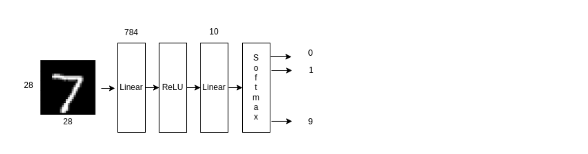
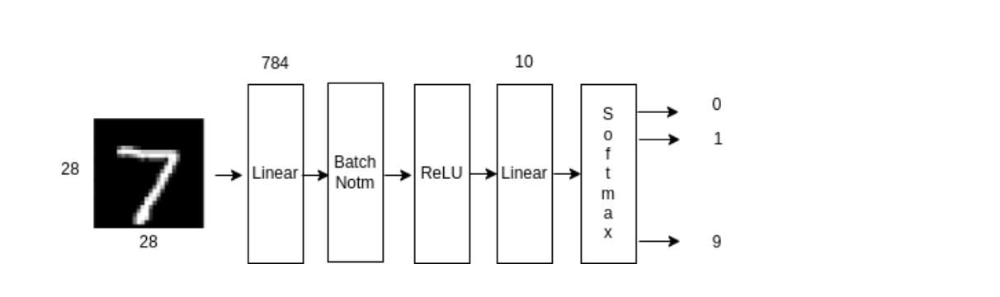
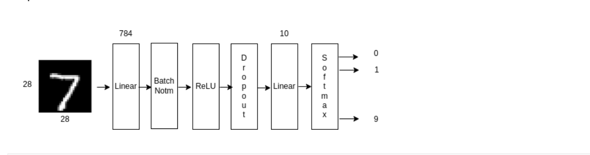
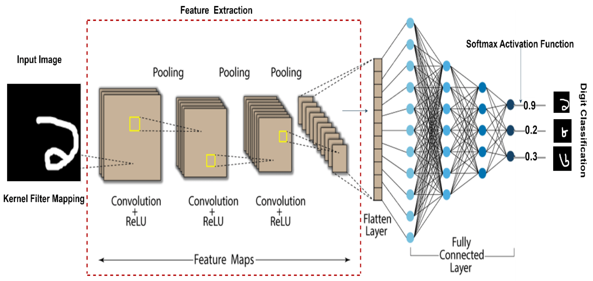
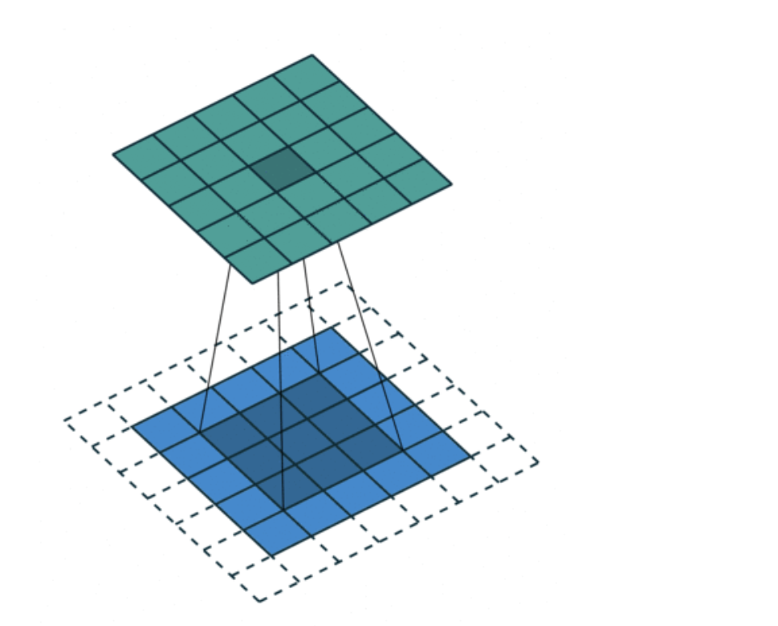
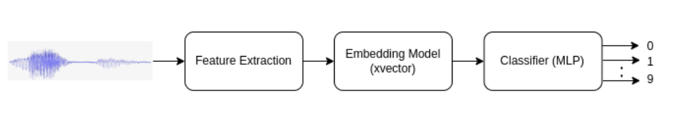
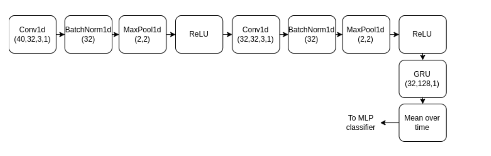
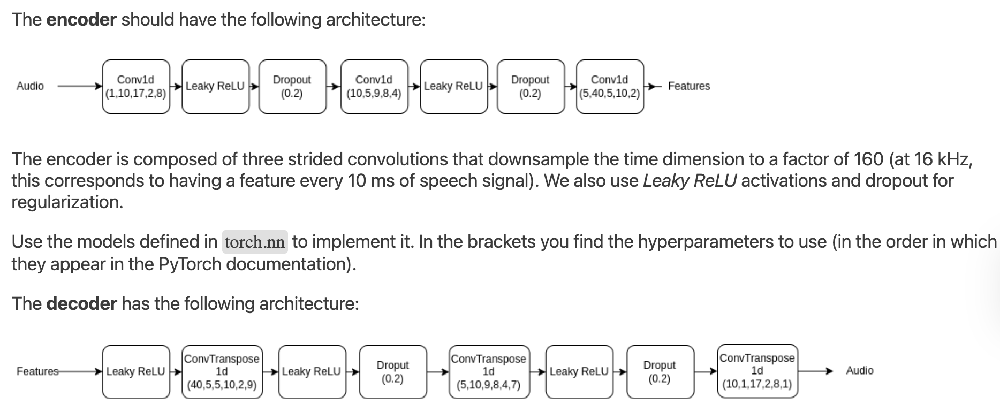
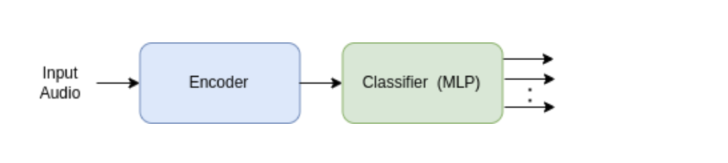
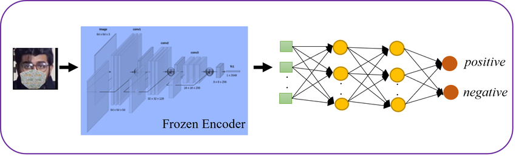

# Neural Network Architectures

This document provides a brief overview of various neural network architectures and their components. Below are descriptions and corresponding images for each architecture, including dimensionality changes for an example input where applicable.

## `Summary

1. [Simple MLP](#simple-mlp)
2. [MLP with Batch Normalization](#mlp-with-batch-normalization)
3. [MLP with Batch Normalization and Dropout](#mlp-with-batch-normalization-and-dropout)
4. [CNN frontend and MLP with Batch Normalization and Dropout](#cnn-frontend-and-mlp-with-batch-normalization-and-dropout)
5. [Convolutional Neural Network (CNN)](#convolutional-neural-network-cnn)
6. [XVector-MLP](#xvector-mlp)
7. [CNN-GRU Architecture](#cnn-gru-architecture)
8. [CNN Encoder-Decoder](#cnn-encoder-decoder)
9. [Encoder-MLP](#encoder-mlp)
10. [Frozen Encoder with MLP](#frozen-encoder-with-mlp)

## Simple MLP

A basic MLP architecture consisting of linear layers and activation functions. It is used for tasks like digit classification.

| Stage               | Operation               | Input Dimensions            | Output Dimensions           | Explanation                                          |
|---------------------|-------------------------|-----------------------------|-----------------------------|------------------------------------------------------|
| Raw Input           | Raw data input         | (Batch size, Input features)|                             | Input raw features to the MLP                      |
| Linear Layer        | Fully connected layer  | (Batch size, Input features)| (Batch size, Hidden units)  | Applies learned weights and biases                 |
| Output Layer        | Fully connected layer  | (Batch size, Hidden units)  | (Batch size, Classes)       | Maps hidden units to output classes                |

## MLP with Batch Normalization

A simple MLP architecture that includes batch normalization for faster convergence and better performance.

| Stage               | Operation               | Input Dimensions            | Output Dimensions           | Explanation                                          |
|---------------------|-------------------------|-----------------------------|-----------------------------|------------------------------------------------------|
| Raw Input           | Raw data input         | (Batch size, Input features)|                             | Input raw features to the MLP                      |
| Linear Layer        | Fully connected layer  | (Batch size, Input features)| (Batch size, Hidden units)  | Applies learned weights and biases                 |
| BatchNorm Layer     | Batch normalization    | (Batch size, Hidden units)  | (Batch size, Hidden units)  | Normalizes activations for stability               |

## MLP with Batch Normalization and Dropout

A fully connected architecture with batch normalization and dropout layers for improved training stability and regularization.

| Stage               | Operation               | Input Dimensions            | Output Dimensions           | Explanation                                          |
|---------------------|-------------------------|-----------------------------|-----------------------------|------------------------------------------------------|
| Raw Input           | Raw data input         | (Batch size, Input features)|                             | Input raw features to the MLP                      |
| Linear Layer        | Fully connected layer  | (Batch size, Input features)| (Batch size, Hidden units)  | Applies learned weights and biases                 |
| BatchNorm Layer     | Batch normalization    | (Batch size, Hidden units)  | (Batch size, Hidden units)  | Normalizes activations for stability               |
| Dropout Layer       | Regularization layer   | (Batch size, Hidden units)  | (Batch size, Hidden units)  | Randomly zeroes activations to prevent overfitting |
| Output Layer        | Fully connected layer  | (Batch size, Hidden units)  | (Batch size, Classes)       | Maps hidden units to output classes                |

## CNN frontend and MLP with Batch Normalization and Dropout

This architecture uses a CNN frontend for feature extraction, followed by an MLP with batch normalization and dropout for classification. The combination helps leverage spatial feature extraction and stable training.

| Stage               | Operation               | Input Dimensions            | Output Dimensions           | Explanation                                          |
|---------------------|-------------------------|-----------------------------|-----------------------------|------------------------------------------------------|
| Raw Input           | Input image data       | (Batch size, Channels, Height, Width)|                             | Input grayscale images                              |
| Conv2D Layer        | Convolutional layer    | (Batch size, Channels, Height, Width)| (Batch size, Filters, Reduced Height, Reduced Width)| Extracts spatial features                          |
| Pooling Layer       | Downsampling layer     | (Batch size, Filters, Reduced Height, Reduced Width)| (Batch size, Filters, Further Reduced Height, Further Reduced Width)| Reduces spatial resolution                        |
| Flatten Layer       | Vectorization          | (Batch size, Filters, Further Reduced Height, Further Reduced Width)| (Batch size, Flattened Features)| Converts feature maps to vectors                  |
| MLP with BatchNorm & Dropout | Fully connected layers | (Batch size, Flattened Features)| (Batch size, Classes)       | Performs final classification                     |

## Convolutional Neural Network (CNN)

A traditional CNN uses convolutional layers followed by pooling layers and activation functions to extract hierarchical features from input images. The features are flattened and passed to fully connected layers for classification.

| Stage               | Operation               | Input Dimensions            | Output Dimensions           | Explanation                                          |
|---------------------|-------------------------|-----------------------------|-----------------------------|------------------------------------------------------|
| Raw Input           | Input image data       | (Batch size, Channels, Height, Width)     |                             | Input grayscale images                              |
| Conv2D Layer        | Convolutional layer    | (Batch size, 1, 28, 28)     | (Batch size, Filters, 26, 26)    | Extracts spatial features                          |
| Pooling Layer       | Downsampling layer     | (Batch size, Filters, 26, 26)    | (Batch size, Filters, 13, 13)    | Reduces spatial resolution                        |
| Flatten Layer       | Vectorization          | (Batch size, Filters, 13, 13)    | (Batch size, 5408)          | Converts feature maps to vectors                  |

## XVector-MLP

A combination of feature extraction using x-vectors and classification using an MLP. It is typically used in speaker recognition tasks.

| Stage               | Operation               | Input Dimensions            | Output Dimensions           | Explanation                                          |
|---------------------|-------------------------|-----------------------------|-----------------------------|------------------------------------------------------|
| Raw Input           | Input audio features   | (Batch size, Audio features)|                             | Input audio feature vectors                        |
| XVector Extraction  | Feature extraction     | (Batch size, Audio features)| (Batch size, Embedding size)| Extracts compact speaker embeddings               |
| MLP Layer           | Fully connected layer  | (Batch size, Embedding size)| (Batch size, Classes)       | Performs final classification                     |

## CNN-GRU Architecture

This architecture combines convolutional layers for feature extraction and a GRU (Gated Recurrent Unit) layer for sequential modeling. It ends with a mean-over-time operation and an MLP for classification.

| Stage               | Operation               | Input Dimensions            | Output Dimensions           | Explanation                                          |
|---------------------|-------------------------|-----------------------------|-----------------------------|------------------------------------------------------|
| Raw Input           | Input sequential data  | (Batch size, 40, Sequence length)|                             | Sequential data input                              |
| Conv1D Layer        | Convolutional layer    | (Batch size, 40, Sequence length)| (Batch size, Filters, Sequence length - 2)| Extracts temporal features                        |
| MaxPool1D Layer     | Downsampling layer     | (Batch size, Filters, Sequence length - 2)| (Batch size, Filters, (Sequence length - 2) / 2)| Reduces temporal resolution                      |
| GRU Layer           | Recurrent layer        | (Batch size, Filters, (Sequence length - 2) / 2)| (Batch size, 128)           | Captures sequential dependencies                  |

## CNN Encoder-Decoder

An encoder-decoder structure with Conv1D layers for feature extraction and transposed convolutions for reconstructing input data. Dropout and Leaky ReLU are used for regularization and activation.

| Stage               | Operation               | Input Dimensions            | Output Dimensions           | Explanation                                          |
|---------------------|-------------------------|-----------------------------|-----------------------------|------------------------------------------------------|
| Raw Input           | Input sequential data  | (Batch size, Channels, Time steps) |                             | Input time-series data                              |
| Encoder Conv1D Layer| Convolutional layer    | (Batch size, 1, Time steps) | (Batch size, 40, Time steps / 160)| Compresses temporal features                       |
| Decoder ConvTranspose1D | Transposed convolution | (Batch size, 40, Time steps / 160) | (Batch size, 1, Time steps) | Reconstructs time-series data                      |

## Encoder-MLP

This architecture uses an encoder for feature extraction from audio signals, followed by an MLP for classification. It is commonly applied to audio-based tasks.

| Stage               | Operation               | Input Dimensions            | Output Dimensions           | Explanation                                          |
|---------------------|-------------------------|-----------------------------|-----------------------------|------------------------------------------------------|
| Raw Input           | Input audio signals    | (Batch size, 1, Time steps) |                             | Input sequential audio                              |
| Encoder Layer       | Feature extraction     | (Batch size, 1, Time steps) | (Batch size, Features)      | Extracts compact representations                   |
| MLP Layer           | Fully connected layer  | (Batch size, Features)      | (Batch size, Classes)       | Performs final classification                     |

## Frozen Encoder with MLP

A pre-trained frozen encoder is used to extract features, which are then passed to an MLP for classification. This approach is efficient when working with limited data.

| Stage               | Operation               | Input Dimensions            | Output Dimensions           | Explanation                                          |
|---------------------|-------------------------|-----------------------------|-----------------------------|------------------------------------------------------|
| Raw Input           | Input image data       | (Batch size, Channels, Height, Width)|                             | Input image data                                   |
| Frozen Encoder      | Pre-trained model      | (Batch size, Channels, Height, Width)| (Batch size, Features)      | Extracts compact image features                   |
| MLP Layer           | Fully connected layer  | (Batch size, Features)      | (Batch size, Classes)       | Performs final classification                     |

---

Feel free to edit this README to include more details or customize the descriptions.
